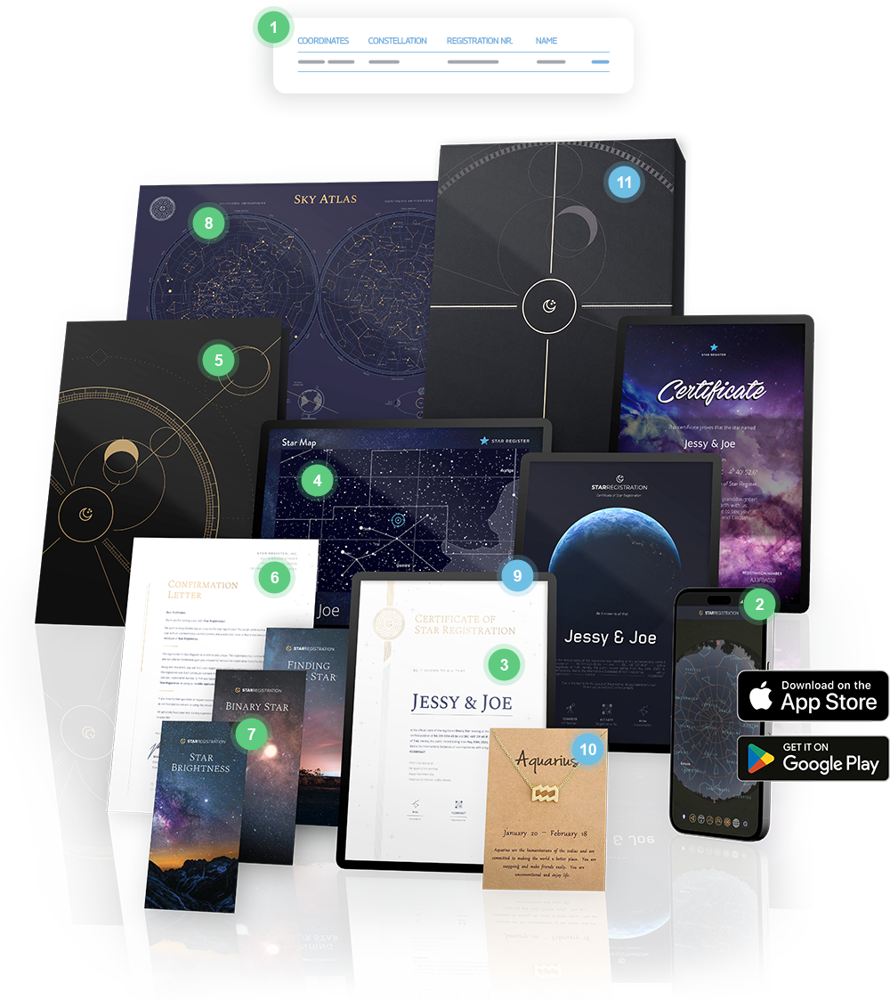

# Writing Task #4
## Question #1 
This project is a fake website that me and my group made. 
I worked on the our company info page,and more specifically 
the following files: about.html, about.css and about-reset.css.
## Question #2
As we were finishing up the first part of this Software developer course,
we were told that our final project would be to create a website with 3 or
more pages for a fake company. Me and my group descided to create a website 
about a company called "Mercury Media", a space company founded by astronauts
that sells you stars and constellations and even create custom ones of your own.
## Question #3
While I was making the info page I was thinking about the information and how the
information and the photos to use. I had to order the information in a way that made
sense so that it started with info about the company and it's origins, followed by 
a section detailing the types of packages and services we offer and ended with a
section that fills like a conclusion with an added hook that leads you straight into
the contact page.
## Question #4
While making the info page I was having trouble with how and what I was going to style
to draw attention, I mostly dealt with this problem Using different font sizes and slight
color changes to draw the eyes into certain parts. I had a hard making the animations for 
the text I also had difficulties when it came to the photos.

I had to look for the right photos to display next to the information, and on top of that 
I also had dificulties finding ones that had transparent backgrounds so that they blend in 
with the page background and I had to also size them correctly so that they were big enough 
to take up enough space so that there weren't alot of empty spots but not too big as to look
weird and push outside the boundries of the container(more on that later).
## Question #5
If I have the chance I would try to make a couple changes to make the page more appealing to 
look at and more vibrant. I would personally make changes to the background and the color scheme
as a whole to make sure the page is not so mundane and boring to look at. I would add more pictures
and probably lessen the amount of paragraphs on the page and find better ways to organize the info
into Parts. I 